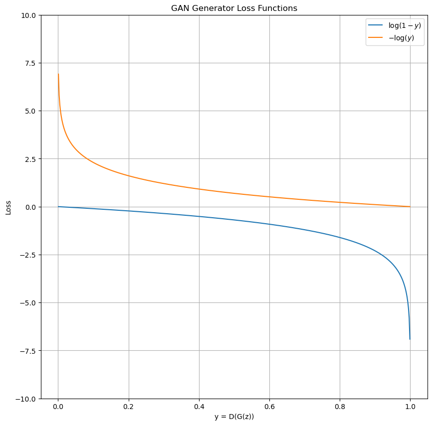

# ⚔️ Generative Adversarial Networks (GANs): Fundamentals  

**Author**: Shawn Cheng  
**Date**: 16 Sep 2025  
**Purpose**: Understand GAN theory for deepfake generation at IDVerse  

---

## 🧠 What is a GAN?

A **Generative Adversarial Network (GAN)** is a deep learning architecture consisting of two neural networks:

- **Generator (G)**: Learns to create fake data (e.g., images) from random noise.
- **Discriminator (D)**: Learns to distinguish real data from fake.

They are trained in a **minimax game**:
> The generator tries to fool the discriminator.  
> The discriminator tries to get better at detecting fakes.

Eventually, the generator produces samples so realistic that the discriminator can't tell them apart.

---

## 🏗️ Core Architecture

| Component | Role | Common Layers |
|--------|------|----------------|
| **Generator** | Maps latent vector `z` → fake image `G(z)` | Transposed conv, BatchNorm, ReLU |
| **Discriminator** | Classifies image as real/fake | Conv, LeakyReLU, Sigmoid |

### Example Flow

```bash
Noise (z) → [Generator] → Fake Image → [Discriminator] → "Fake"
Real Image → [Discriminator] → "Real"
```

---

## 📉 Loss Functions

### 1. **Original GAN Loss (Minimax)**

From Goodfellow et al. (2014):

$$
\min_G \max_D V(D, G) = \mathbb{E}_{x \sim p_{data}}[\log D(x)] + \mathbb{E}_{z \sim p_z}[\log(1 - D(G(z)))]
$$

- `D` wants to maximize: correctly classify real/fake
- `G` wants to minimize: make `D(G(z)) ≈ 1` (fool D)

### 2. **Modified Loss for Generator**

In practice, train G to maximize $\log D(G(z))$, i.e., minimize $-\log D(G(z))$. This avoids saturation (providing much stronger gradients) early in training.

#### Explain

Let’s define:

- $f_1(y) = \log(1 - y)$ → **original generator loss** (to be **minimized**)
- $f_2(y) = -\log(y)$ → **non-saturating generator loss** (to be **minimized**)

We’ll plot both over $y \in (0, 1)$.

  

#### 🔹 Function 1: $f_1(y) = \log(1 - y)$

| $y (D(G(z)))$ | $f₁(y) = log(1−y)$ | Gradient $f_1'(y) = -\frac{1}{1 - y}$ |
|-------------|------------------|------------------------------------------|
| 0.0         | log(1) = 0       | −1.0                                     |
| 0.1         | ≈ −0.105         | −1.11                                    |
| 0.5         | ≈ −0.693         | −2.0                                     |
| 0.9         | ≈ −2.30          | −10.0                                    |
| 0.99        | ≈ −4.60          | −100                                     |

✅ **Shape**: Starts at 0 when $y=0$, decreases slowly at first, then **plunges steeply** as $y \to 1$.

➡️ **Key observation**:  

- When the generator is **poor**, $y = D(G(z)) \approx 0$.  
- In this region, $f_1(y) \approx 0$, and the curve is **nearly flat**.  
- Even though the derivative is −1 at y=0, **in practice**, because the discriminator is very confident (outputs near 0), small changes in $G(z)$ cause **almost no change in y**, so the **effective gradient through the full network is tiny** → **saturation**.

#### 🔹 Function 2: $f_2(y) = -\log(y)$

| $y (D(G(z)))$ | $f₂(y) = −log(y)$ | Gradient $f_2'(y) = -\frac{1}{y}$ |
|-------------|------------------|--------------------------------------|
| 0.01        | ≈ 4.60           | −100                                 |
| 0.1         | ≈ 2.30           | −10                                  |
| 0.5         | ≈ 0.693          | −2.0                                 |
| 0.9         | ≈ 0.105          | −1.11                                |
| 1.0         | 0                | −1.0                                 |

✅ **Shape**: Starts at **+∞** when $y \to 0^+$, decreases **steeply** at first, then flattens as $y \to 1$.

➡️ **Key observation**:  

- When the generator is **poor** ($y \approx 0$), the loss is **very large**, and the gradient is **very strong** (e.g., −100 at y=0.01).  
- This gives the generator a **powerful learning signal**: “You’re failing badly—adjust your weights significantly!”

---

## 🛠️ Training Process

1. **Train Discriminator**:
   - On real images → label as 1
   - On fake images (from G) → label as 0
2. **Train Generator**:
   - Generate fake images
   - Use D’s feedback to improve (via gradients)
3. **Alternate** between D and G steps (e.g., 1:1 or 5:1)

🔁 Repeat until convergence.

---

## ⚠️ Common Challenges

| Issue | Why It Happens | How to Fix |
|------|----------------|-----------|
| **Mode Collapse** | G generates same output repeatedly | Use batch/instance norm, diverse z |
| **Training Instability** | D gets too strong too fast | Use label smoothing, adjust LR |
| **Vanishing Gradients** | D is too confident | Use soft labels, feature matching |

---

## 📚 References

- [Goodfellow et al. (2014) – GAN Paper](https://arxiv.org/abs/1406.2661)
- [CS231n – GAN Lecture](https://www.youtube.com/watch?v=8L11aMN5KY8)
- [PyTorch DCGAN Tutorial](https://pytorch.org/tutorials/beginner/dcgan_faces_tutorial.html)

---

## 📝 My Takeaways

- GANs are powerful but unstable — careful tuning needed.
- Understanding loss functions is key to debugging training.
- At IDVerse, we likely use advanced variants (StyleGAN, ADA), but DCGAN is the foundation.
