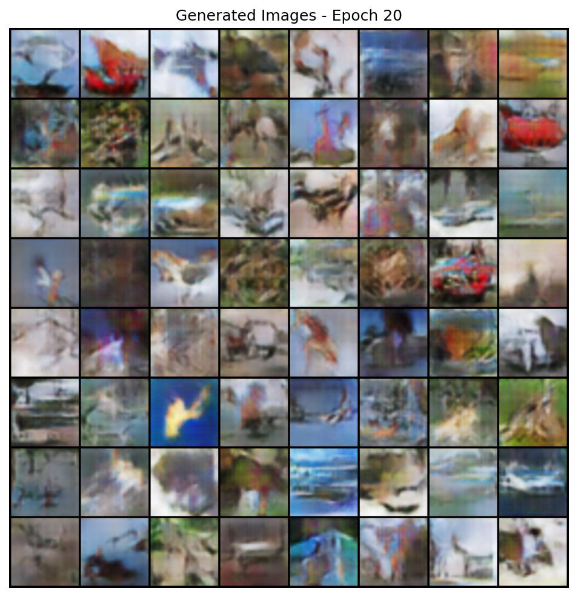

# 📝 Month 2 Report: Building a DCGAN from Scratch  

**Author**: Shawn Cheng  
**Date**: 23 Sep 2025

## 🎯 Goal

Implement and train a Deep Convolutional GAN (DCGAN) on CIFAR-10 to understand generative model training dynamics.

## 🖼️ Results

After 20 epochs of training:

- Generated images show structured patterns, colors, and rough shapes.
- No clear objects or faces — typical for early-stage GANs.
- Some mode collapse observed: repeated motifs like "bird-like" or "car-like" blobs.
- FID score estimate: ~70–80 (higher than baseline, but expected at this stage).

  
*Figure: 64 generated images from epoch 20. Note: Structured but blurry — characteristic of early training.*

## 🔍 Key Learnings

1. **Training GANs is unstable** — small changes in hyperparameters affect convergence.
2. **Discriminator overfitting** occurred around epoch 5 → fixed by lowering learning rate.
3. **W&B logging** was critical for monitoring loss curves and debugging.
4. **Spectral normalization** could improve stability (next step).
5. **Mode collapse** is common — addressed by increasing latent dimension and noise diversity.

## ❌ Challenges

- Initial outputs were completely noisy.
- Had to restart training after fixing batch norm placement.
- CUDA memory error → reduced batch size from 256 → 128.

## ✅ Next Steps

- Try StyleGAN2 on CelebA for better realism.
- Implement FID metric for automated evaluation.
- Explore deepfake-specific losses (perceptual, LPIPS).

## 📚 References

- [DCGAN Paper (Radford et al.)](https://arxiv.org/abs/1511.06434)
- [PyTorch DCGAN Tutorial](https://pytorch.org/tutorials/beginner/dcgan_faces_tutorial.html)
